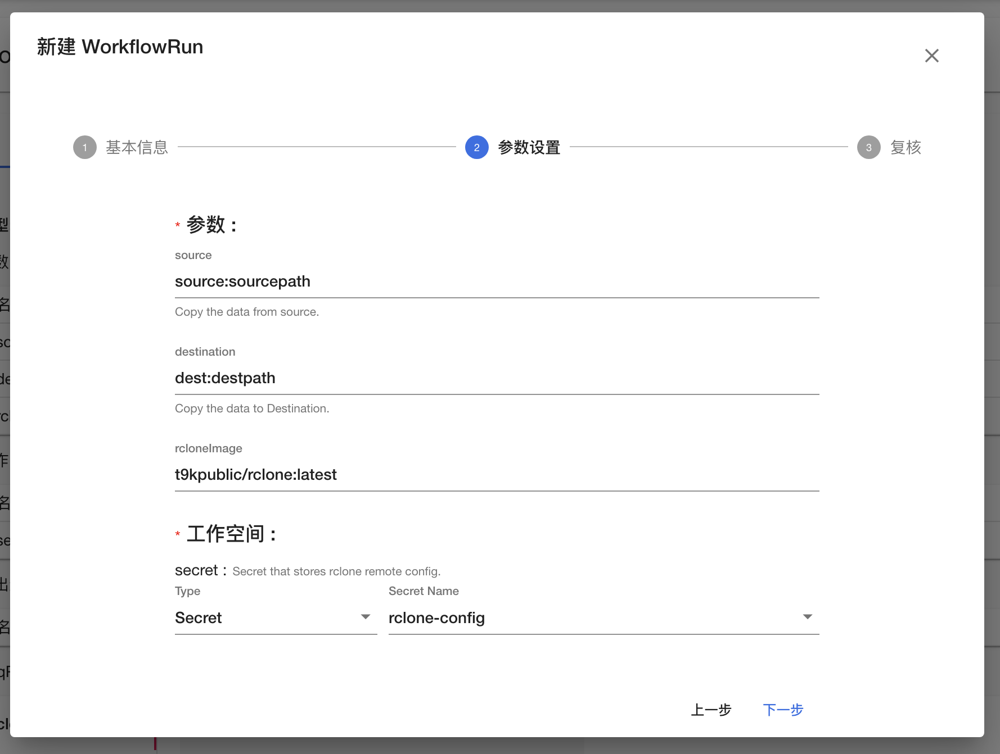

# Rclone 用户使用手册

在使用 TensorStack AI 平台时，您可能会遇到需要在不同的存储服务之间复制和移动数据的情况。本文介绍如何使用 [Rclone:octicons-link-external-16:](https://rclone.org/) 来应对这些需求。

## 简介

Rclone 是一个用于管理存储系统上文件的命令行程序。它能够在云端实现类似于 Unix 命令 rsync、cp、mv、mount、ls、ncdu、tree、rm 和 cat 等的功能。

Rclone 支持包括 S3、FTP、HTTP 在内的多种云存储 provider，见[列表:octicons-link-external-16:](https://rclone.org/#providers)。

其基本语法如下：

``` shell
Syntax: [options] subcommand <parameters> <parameters...>
```

例如：

``` shell
rclone ls remote:path # lists a remote
rclone copy /local/path remote:path # copies /local/path to the remote
rclone sync --interactive /local/path remote:path # syncs /local/path to the remote
```

## 安装和配置

### 安装

方法一：对于 Linux/macOS/BSD 系统，可以直接通过脚本安装：

``` shell
sudo -v ; curl https://rclone.org/install.sh | sudo bash
```

方法二：从 [https://rclone.org/downloads/:octicons-link-external-16:](https://rclone.org/downloads/) 下载并安装对应的版本。

!!! tip "提示"
    TensorStack AI 平台提供的 [Notebook 标准镜像](../../reference/image/notebook-standard-image-list.md)中已经预装了 Rclone。

### 创建配置文件

Rclone 的配置文件默认存放在 `$HOME/.config/rclone/rclone.conf` 路径下，您可以通过 `rclone config file` 命令获取配置文件的路径。我们提供两种方式来设置 rclone 配置文件。

#### 直接编辑配置文件

Rclone 配置的云存储服务 provider 被称为 remote，您可以仿照下面的例子快速生成配置文件：

``` shell
rclone config touch

cat > $HOME/.config/rclone/rclone.conf <<EOF
[cdc]
type = ftp
host = ftp.cdc.gov
user = anonymous
pass = x4cjd-uZkqTcWasprQqOeFjk5rR9

# 注意：考虑网络情况，这里使用了第三方的 https://ghproxy.com 服务作为代理。
[github]
type = http
url = https://ghproxy.com/https://github.com

[corps3]
type = s3
provider = Ceph
access_key_id = <your-access-key>
secret_access_key = <your-secret-key>
endpoint = <http[s]://your-s3-endpoint>
acl = private
EOF
```

rclone 的配置文件采用 INI 文件格式，每个存储服务（remote）通过一个方括号标记的配置块定义，例如上文中的 `[cdc]` 和 `[corps3]`：

* 方括号的 `key = value` 定义了这个 remoet 的其它属性，例如服务地址、用户、密码等；
* `type` 是个特殊的 `key`，标识[存储系统:octicons-link-external-16:](https://rclone.org/overview/)，其中 `value` 是命令 `rclone help backends` 返回的内部小写名称。


##### 常用 remote 的参数

FTP 类型需要指定以下参数：

* `ftp-remote-name`：remote 的名称，前后需要添加方括号。
* `host`：服务的地址。
* `user`：用户名。
* `pass`：使用 `rclone obscure` 命令加密后的密码。

HTTP 类型需要指定以下参数：

* `http-remote-name`：remote 的名称，前后需要添加方括号。
* `url`：参考格式为 `https://<user>:<password>@example.com`，其中：
    * `https`：取决于具体的协议，可以是 `https` 或者 `http`。
    * `<user>`：用户名。
    * `<password>`：密码。
    * `example.com`：服务的地址。
    * 在不需要身份验证信息的场景下，可以省略 `<user>:<password>@` 部分。

S3 类型需要指定以下参数：

* `s3-remote-name`：remote 的名称，前后需要添加方括号。
* `provider`：提供 S3 接口的底层服务，TensorStack Asset Hub 中使用的是 Ceph。
* `access_key_id`：S3 access key，可以从 s3cfg 的 `access_key` 字段中获取。
* `secret_access_key`：S3 secret key，可以从 s3cfg 的 `secret_key` 字段中获取。
* `endpoint`：S3 endpoint，可以从 s3cfg 的 `host_base` 字段中获取。

更多详情以及更多类型的存储技术支持，请参考 [https://rclone.org/#providers:octicons-link-external-16:](https://rclone.org/#providers)。

#### 通过命令行交互创建

运行 `rclone config` 命令，交互式地生成配置文件。

## 命令行使用

使用上述 Rclone 配置文件， 我们演示如何使用 Rclone 的 `ls` 和 `copy` 命令。`ls` 系列命令用于列出 remote 中的文件和目录，其格式为 `rclone ls remote:path`。`copy` 命令用于将文件从源位置复制到目标位置，其格式为 `rclone copy source:sourcepath dest:destpath`，其中 `source` 和 `dest` 都是在 Rclone 配置文件中定义的 remote 名称。

!!! note "注意"
    TensorStack Asset Hub 提供的 S3 凭证通常只包含一个 bucket 的只读/读写权限，在后面的使用中需要确认 S3 凭证具有目标 bucket 的写权限。

### FTP 到 S3

查看 FTP 服务中的文件：

``` shell
# lsd 命令仅显示目录，不显示文件
rclone lsd cdc:/

# lsf 命令显示 remote 中的目录和文件。它的使用体验非常类似于 Unix 系统中的 ls 命令。
# 这里 cdc:/pub 的 "/" 可以省略
rclone lsf cdc:/pub

# ls 命令递归地显示目录中所有文件的大小和路径，lsl 命令会额外显示上次修改时间
rclone ls cdc:pub/FOIAREQ
rclone lsl cdc:pub/FOIAREQ
```

从 FTP 复制单个文件到 S3 bucket `test` 中：

``` shell
# -P 选项用于查看实时传输统计
rclone copy -P cdc:pub/FOIAREQ/185661-508.pdf corps3:test
```

从 FTP 复制文件夹中的所有文件到 S3 bucket `test` 中（dry-run）：

``` shell
# --dry-run 选项用于不实际进行复制，只查看会复制的文件
rclone copy -P --dry-run cdc:pub/FOIAREQ corps3:test/FOIAREQ
```

查看 S3 bucket `test` 中的所有内容：

``` shell
rclone ls corps3:test
```

### HTTP 到 S3

从 HTTP 复制文件到 S3，以 Rclone 安装包 https://github.com/rclone/rclone/releases/download/v1.62.2/rclone-v1.62.2-linux-amd64.deb 为例：

``` shell
rclone copy -P github:rclone/rclone/releases/download/v1.62.2/rclone-v1.62.2-linux-amd64.deb \
  corps3:test
```

### S3 到 S3

从一个 S3 bucket 复制数据到另一个 S3 bucket 中：

``` shell
rclone copy -P corps3:test/185661-508.pdf corps3:pub
```

### Local 到 S3

从本地复制 `date.txt` 到 S3 的 bucket `test` 中：

``` shell
rclone copy -P date.txt corps3:test
```

从本地复制文件夹中的所有数据到 S3 的 bucket `test` 中（dry-run）：

``` shell
rclone copy -P --dry-run dir corps3:test/dir
```

Windows 中的用法（dry-run）：

``` shell
rclone copy -P --dry-run "E:\folder-name" corps3:test/dir

# 使用盘符的根目录时，不要加引号
rclone copy -P --dry-run E:\ corps3:test/dir
```

## 工作流使用

T9k 平台提供的工作流功能可以让我们更加可靠、系统的运行 rclone 进行数据复制、备份等工作。例如，将数据从一个远程仓库复制到另一个远程仓库，从公开 FTP 数据库复制数据到 S3 存储中等。

### 准备工作

通过工作流使用 Rclone 之前，建议您在本地配置并测试 Rclone 配置文件。

首先获取配置文件的路径：

``` shell
# 本地测试
rclone config file
```

然后在集群中创建 Secret 来记录远程存储的身份信息：

``` shell
# 使用 Rclone 配置文件创建 secret，指定 data 中的 key 为 rclone.conf
kubectl -n <project> create secret generic <secret> --from-file=rclone.conf=<rcloneConfig>
```

这里需要指定三个参数：

* `<project>`：项目名称。
* `<secret>`：创建的 Secret 的名称。
* `<rcloneConfig>`：配置文件的路径。

创建完成后，通过以下命令进行验证：

``` shell
$ kubectl -n <project> get secret <secret> -o jsonpath={.data."rclone\.conf"} | base64 -d

# 输出 Rclone 配置文件的内容；验证和本地的 config 一致
[s3]
type = s3
provider = Ceph
access_key_id = <your-access-key>
secret_access_key = <your-secret-key>
endpoint = http://<your-host>
```

### 创建工作流模板

运行命令创建工作流模板：

``` shell
kubectl apply -n <project> -f workflow.yaml
```

### 运行工作流

#### 通过控制台

在工作流控制台中找到对应项目，点击工作流模板 `rclone-copy`。然后点击右上角的“新建 WorkflowRun”。

确认基本信息后，点击“下一步”。

在参数设置中，填写以下参数（其他参数可以保持默认值）：

* `source`：待复制的数据源，对应 `rclone copy` 命令中的 `source:sourcepath`。
* `destination`：复制数据的目的地，对应 `rclone copy` 命令中的 `dest:destpath`。

然后设置工作空间：

* `secret`：选择 Secret 类型和保存 Rclone 配置文件的 Secret。

<figure class="screenshot">
  
</figure>

点击“下一步”，复核后点击“创建”，运行 WorkflowRun。

在工作流运行的控制台查看 WorkflowRun 的运行情况。

#### 通过命令行

编辑 `workflowrun.yaml`，修改 `spec.params` 字段中下列参数的值：

* `source`：待复制的数据源，对应 `rclone copy` 命令中的 `source:sourcepath`。
* `destination`：复制数据的目的地，对应 `rclone copy` 命令中的 `dest:destpath`。

修改 `spec.workflows` 字段中下列参数的值：

* `secretName`：保存 Rclone 配置文件的 Secret 名称。

使用 kubectl 创建 WorkflowRun：

``` shell
$ kubectl create -n <project> -f workflowrun.yaml

workflowrun.batch.tensorstack.dev/rclone-copy-run-d8lqp created
```

监控 WorkflowRun 及其子资源的状态：

``` shell
# 查看 WorkflowRun 状态
kubectl -n <project> describe workflowrun.batch.tensorstack.dev rclone-copy-run-d8lqp

# 查看 Pod 状态
kubectl -n <project> get pod -l batch.tensorstack.dev/workflowRun=rclone-copy-run-d8lqp -w

# 输出 Pod 日志
kubectl -n <project> logs -l batch.tensorstack.dev/workflowRun=rclone-copy-run-d8lqp -f
```

### 说明

#### 镜像

本示例使用到以下镜像：

* `t9kpublic/rclone:latest`：Rclone 的镜像

#### 运行资源

本工作流设置的默认运行资源为：

``` YAML
requests:
   cpu: 500m
   memory: 1Gi
limits:
   cpu: 4
   memory: 16Gi
```

## 附录

### workflow.yaml

``` YAML title="workflow.yaml"
apiVersion: batch.tensorstack.dev/v1beta1
kind: WorkflowTemplate
metadata:
  labels:
    workflowtemplate/tags: rclone-copy
  name: rclone-copy
spec:
  params:
    - default: ""
      description: Copy the data from source.
      name: source
    - default: ""
      description: Copy the data to Destination.
      name: destination
    - default: "t9kpublic/rclone:latest"
      description:
      name: rclone-image
    - default: "10s"
      description: Interval between printing stats, e.g. 500ms, 60s, 5m (0 to disable) (default 10s).
      name: stats
    - default: "DEBUG"
      description: Log level DEBUG|INFO|NOTICE|ERROR (default "DEBUG").
      name: log-level
    - default: "10"
      description: Number of low level retries to do (default 10).
      name: low-level-retries
    - default: "3"
      description: Retry operations this many times if they fail (default 3).
      name: retries
    - default: "false"
      description: Set value to "true" if you do NOT want to verify the server SSL certificate (insecure)
      name: no-check-certificate
  seqPod:
    steps:
      - args:
          - '--config'
          - '/t9k/workspaces/secret/rclone.conf'
          - 'copy'
          - '$(params.source)'
          - '$(params.destination)'
          - '--stats'
          - '$(params.stats)'
          - '--log-level'
          - '$(params.log-level)'
          - '--low-level-retries'
          - '$(params.low-level-retries)'
          - '--retries'
          - '$(params.retries)'
          - '--no-check-certificate=$(params.no-check-certificate)'
        command:
          - 'rclone'
        image: $(params.rclone-image)
        name: rclone
        resources:
          requests:
            cpu: 500m
            memory: 1Gi
          limits:
            cpu: 4
            memory: 16Gi
  type: SeqPod
  workspaces:
    - description: Secret that stores rclone.conf
      name: secret
```

### workflowrun.yaml

``` YAML title="workflowrun.yaml"
apiVersion: batch.tensorstack.dev/v1beta1
kind: WorkflowRun
metadata:
  generateName: rclone-copy-run-
spec:
  params:
    - name: source
      value: "cdc:pub/FOIAREQ"
    - name: destination
      value: "corps3:test/FOIAREQ"
  workflowTemplateRef: rclone-copy
  workspaces:
    - name: secret
      secret:
        secretName: rclone-config
```
