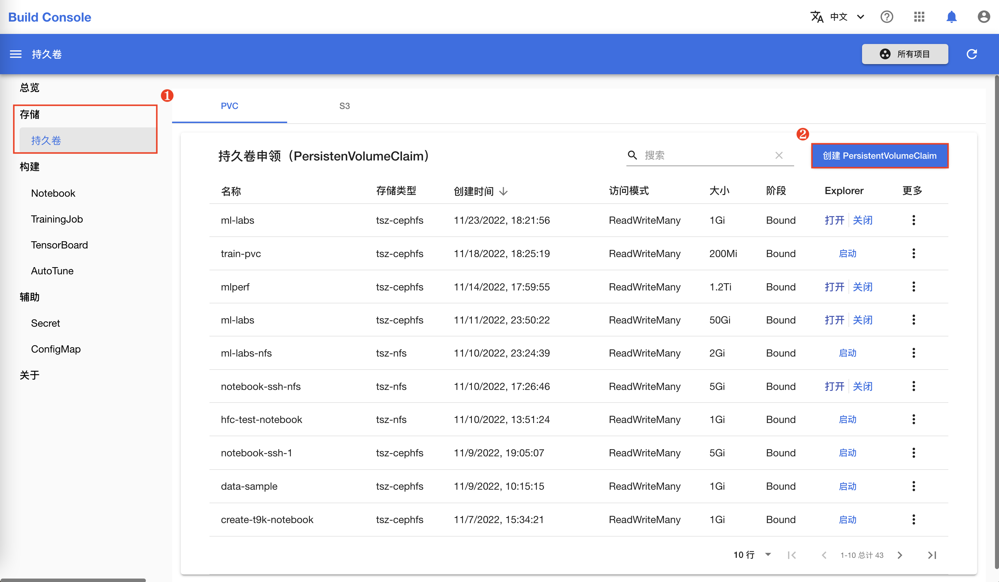
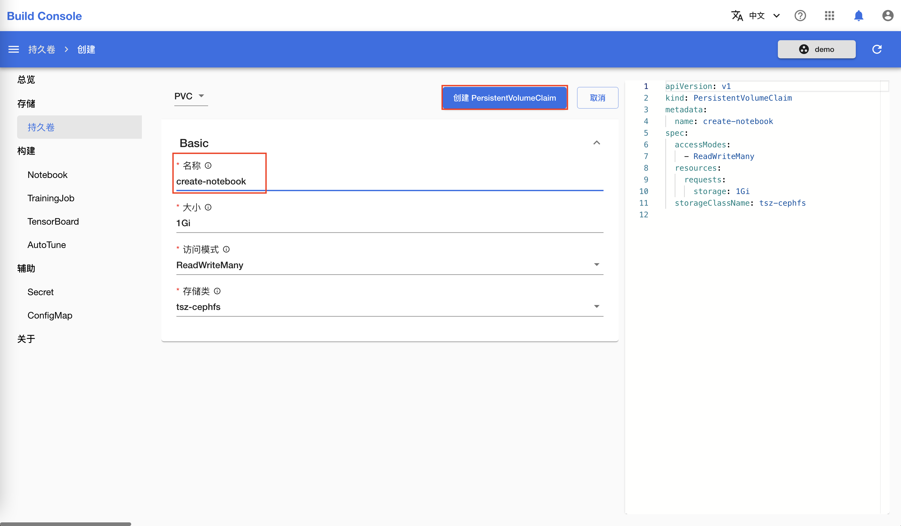
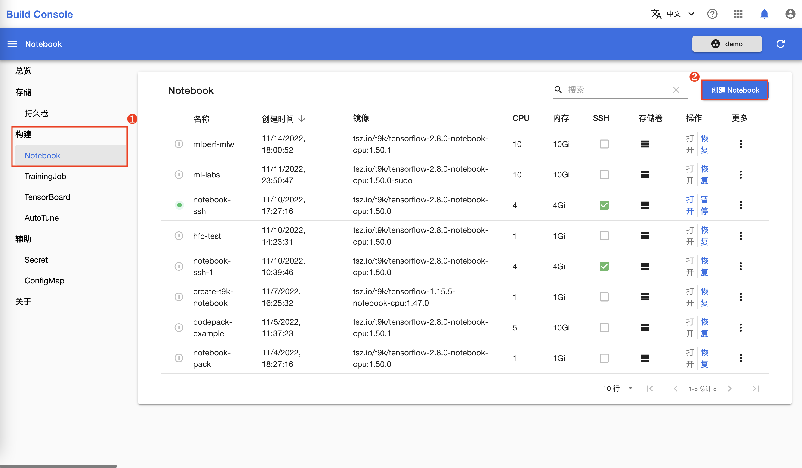
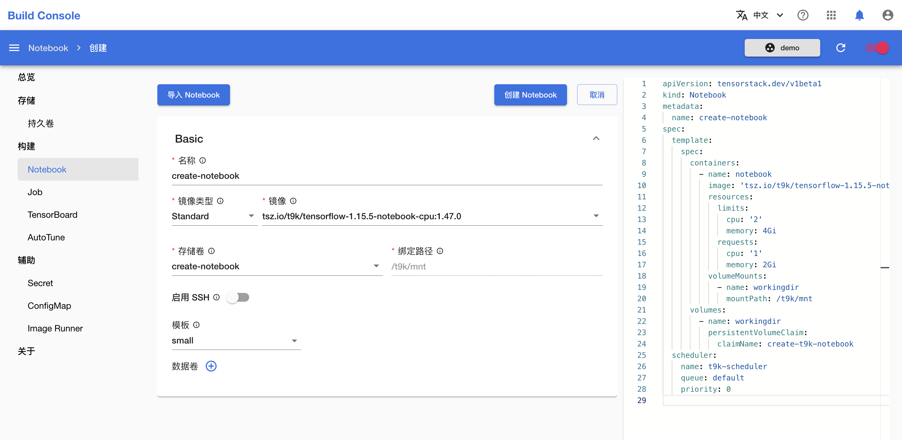
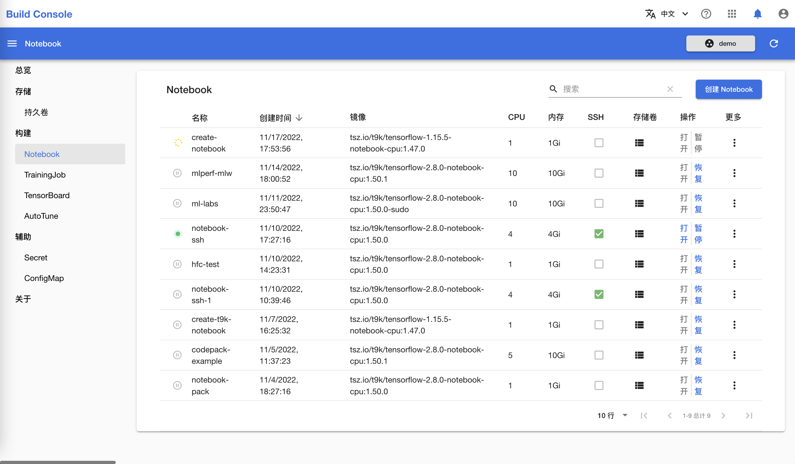
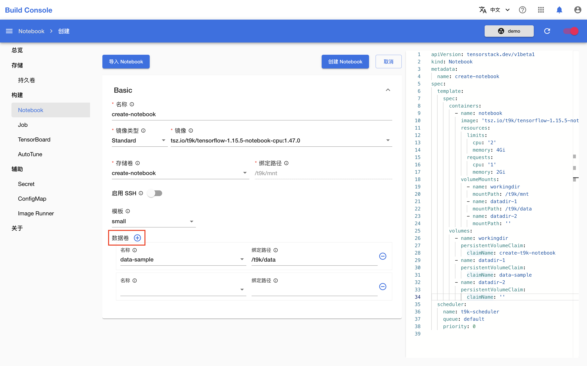
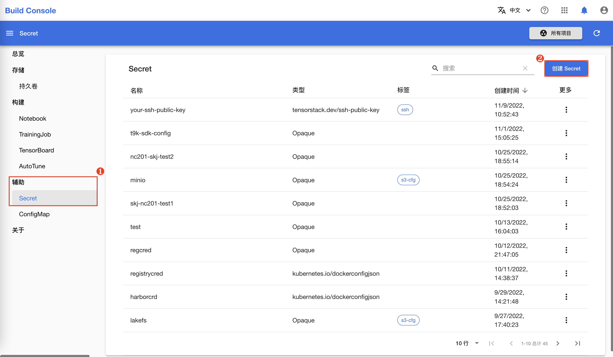
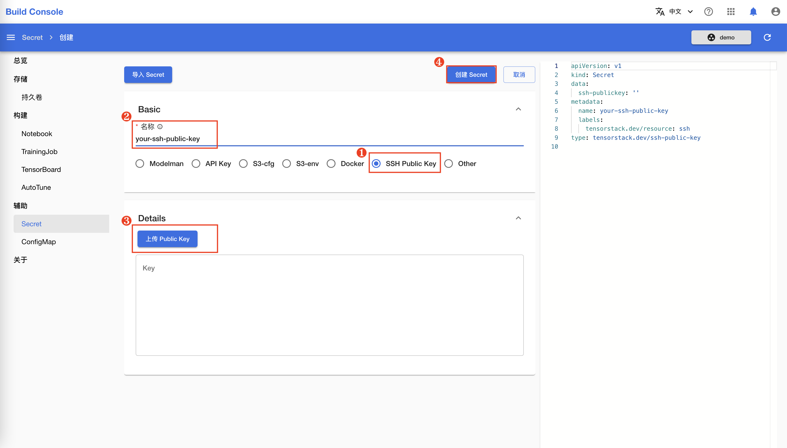
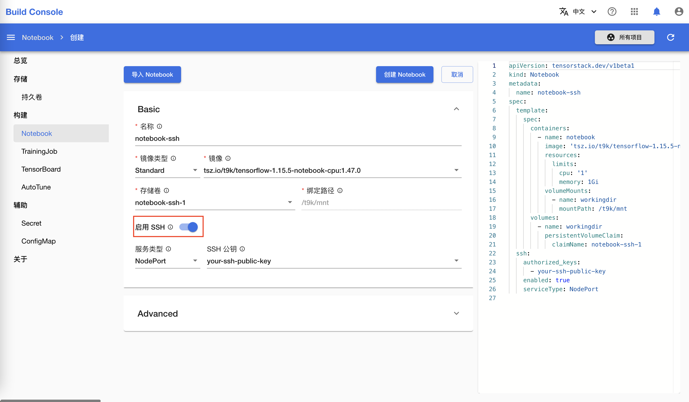

# 创建 Notebook

本教程演示如何创建 Notebook。

## 创建持久卷申领

创建 Notebook 时，需要至少绑定一个持久卷申领来存储代码、数据等文件。如果您的项目中已有合适的持久卷，则可以直接进入下一节。

在模型构建控制台的左侧导航菜单中点击**存储 > 持久卷** 进入持久卷申领（PersistentVolumeClaim）管理页面。然后点击右上角的**创建 PersistentVolumeClaim** 进入创建页面：

<figure class="screenshot">
  
</figure>

在持久卷申领创建页面，**名称**填写 `create-notebook`，其他参数保持默认值，然后点击**创建 PersistentVolumeClaim** 进行创建：

<figure class="screenshot">
  
</figure>

## 创建标准的 Notebook

在模型构建控制台的左侧导航菜单中点击**构建 > Notebook** 进入 Notebook 管理页面，然后点击右上角的**创建 Notebook** 进入创建页面：

<figure class="screenshot">
  
</figure>

在 Notebook 创建页面，如下填写各个参数：

* **名称**填写 `create-notebook`。
* **存储卷**选择上一节创建的 `create-notebook`（或其他合适的存储卷）。存储卷会被挂载到 Notebook 的 `/t9k/mnt` 目录下。
* **镜像**根据您想使用的机器学习框架（如 TensorFlow、PyTorch 等）及其版本选择一个标准 Notebook 镜像。

其他参数保持默认值。完成之后，点击**创建 Notebook** 进行创建。

<figure class="screenshot">
  
</figure>

!!! info "信息"
    标准 Notebook 镜像的默认用户是 `t9kuser`，其主目录（home directory）是 `/t9k/mnt`。

回到 Notebook 管理页面查看新创建的 Notebook：

<figure class="screenshot">
  
</figure>

如果 Notebook 被分配到的节点中已经有了对应的 Notebook 镜像，那么 Notebook 通常能在 10 秒内运行；否则，可能需要几分钟来拉取镜像。Notebook 运行后，您可以[使用 Notebook](./use-notebook.md)。

## 高级功能

### 添加额外的存储卷

可以为 Notebook 绑定额外的数据卷。如下图所示：

<figure class="screenshot">
  
</figure>

每绑定一个数据卷需要填写如下参数：

* `名称`：使用的持久卷名称。
* `绑定路径`：将持久卷绑定到 Notebook 的指定路径下。

在上图的示例中，我们将持久卷 `data-sample` 绑定到了 Notebook 的 `/t9k/data` 路径下。您可以在 Notebook 中通过对应路径访问持久卷中的数据。

## 启用 SSH 选项

如果您想使用 SSH 连接到 Notebook 容器中来管理其中的文件，或者使用本地的 IDE 来编辑 Notebook 中的代码，**启用 SSH** 能够帮助您在 Notebook 中运行一个 SSH 服务。

### 存储 SSH 公钥

Notebook 的 SSH 服务只允许通过密钥对进行验证，因此您需要上传公钥以使用 SSH 连接。TensorStack AI 平台使用 Secret 存储公钥信息。如果您已经创建了包含公钥的 Secret，则可以直接进入下一节。

在模型构建控制台的左侧导航菜单中点击**辅助 > Secret**，然后点击右上角的**创建 Secret** 进入的创建页面：

<figure class="screenshot">
  
</figure>

在 Secret 创建页面，选择类型为 **SSH Public Key**，填写名称并上传公钥。最后点击**创建 Secret** 进行创建：

!!! info "信息"
    如果您没有生成过密钥对，或者不知道从哪里获取公钥，那么您可以参阅 [SSH 文档:octicons-link-external-16:](https://www.ssh.com/academy/ssh/keygen)或者 [Windows 文档:octicons-link-external-16:](https://learn.microsoft.com/zh-cn/windows-server/administration/openssh/openssh_keymanagement#user-key-generation)。

<figure class="screenshot">
  
</figure>

### 创建支持 SSH 连接的 Notebook

创建 Notebook 时，开启**启用 SSH**，然后填写如下参数：

* `服务类型`：默认值为 `NodePort`，此时 Kubernetes 控制平面会分配一个端口，集群中的每个节点都会将该端口代理到 Notebook 服务中。如果选择 `ClusterIP`，则会在集群内部 IP 上公开服务，您只能从集群内访问该服务。
* `SSH 公钥`：用来验证登录者身份，Notebook 的 SSH 服务只允许通过公钥进行身份认证。这里是一个可多选的选择框，请选择您想添加的所有 Secret 后点击网页的其他空白位置。

<figure class="screenshot">
  
</figure>

!!! info "信息"
    关于服务类型，详细的说明可以参阅 Kubernetes 官方文档[发布服务（服务类型）:octicons-link-external-16:](https://kubernetes.io/zh-cn/docs/concepts/services-networking/service/#publishing-services-service-types){target=_blank}。

点击**创建 Notebook**，等待运行之后，您可以[通过 SSH 连接远程使用 Notebook](./use-notebook-remotely-via-ssh-connection.md)。
