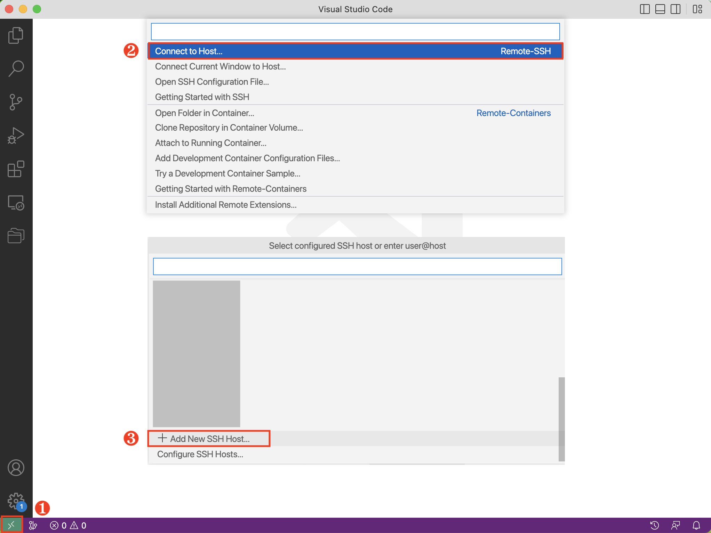

# 通过 SSH 连接远程使用 Notebook

本教程演示如何通过 SSH 连接远程使用 Notebook。

## 获取连接方式

为了使用 SSH 连接到 Notebook，您首先要获取 SSH 的用户名（Username）、主机地址（Host）和端口（Port）。其中主机地址和端口需要从控制台获取。下文中我们会用 `<Host>` 代表获取的主机地址，`<Port>` 代表使用的端口。

!!! info "信息"
    标准 Notebook 镜像的默认用户是 `t9kuser`，其主目录（home directory）是 `/t9k/mnt`。

### 通过 t9k-pf 命令行工具获取连接方式

t9k-pf 命令行工具的功能类似于 `kubectl port-forward`，可以让您在本地通过端口转发的方式获取 Notebook 的 SSH 连接方式。

#### 准备 t9k-pf 命令行工具

首先您需要参照 t9k-pf [安装教程](../../tool/tensorstack-pf-cli/index.md#安装)完成命令行工具的安装。

然后您需要参照 t9k-pf [身份认证和授权教程](../../tool/tensorstack-pf-cli/index.md#身份认证和授权)，通过 API Key 来完成相应的身份认证和授权。

#### 通过 URL 获取 Notebook 的 SSH 连接方式

您可以通过 Notebook 在浏览器地址栏中的地址来获取其 SSH 连接方式，例如下面我们打开了目标 Notebook 的一个 `.ipynb` 文件。

<figure class="screenshot">
    
</figure>

在浏览器中复制红框中的内容，然后在命令行中输入 `t9k-pf notebook` （或者 `t9k-pf nb`）并粘贴所复制的内容，便可开启 port-forward。

``` bash
t9k-pf notebook <tensorstack-host>/t9k/build-console/projects/demo/notebooks/demo-notebook/lab/tree/demo.ipynb
```

输入以上命令后，命令行会随机返回一个本地端口。例如 `127.0.0.1:57873`，那么获取的 `<Host>` 便为 `127.0.0.1`, `<Port>` 便为 `57873`，然后您便可参照 [SSH 远程连接教程](#ssh-远程连接)与目标 Notebook 建立 SSH 连接。

除了上述图中的例子，输入以下地址、或者其他不同结尾的地址也都能起到相同的作用：

``` bash
<tensorstack-host>/t9k/build-console/projects/demo/notebooks/demo-notebook/tree?
<tensorstack-host>/t9k/build-console/projects/demo/notebooks/demo-notebook/lab
<tensorstack-host>/t9k/build-console/projects/demo/notebooks/demo-notebook/<any-url>
```

您还可以通过下述格式指定您的本地端口，其中 `<URL>` 代表地址栏的地址，`<LocalPort>` 代表您指定的端口号：

``` bash
t9k-pf notebook <URL> <LocalPort>
```

!!! note "注意"  
    小于 1024 的端口需要管理员权限才可以绑定。

例如输入：

``` bash
t9k-pf notebook <tensorstack-host>/t9k/build-console/projects/demo/notebooks/demo-notebook/lab/tree/demo.ipynb 3333
```

命令行会打印出 `127.0.0.1:3333`，即 `<Port>` 被指定为 `3333`。然后同样参照 [SSH 远程连接教程](#ssh-远程连接)与目标 Notebook 建立 SSH 连接。

!!! note "注意" 
    在 port-forward 成功后，您仍然需要保持 t9k-pf 命令行窗口一直保持运行状态。

## SSH 远程连接

### 使用 Terminal

在 Terminal 中运行以下命令以连接到 Notebook：

``` bash
ssh t9kuser@<Host> -p <Port> \
  -o StrictHostKeyChecking=no \
  -o GlobalKnownHostsFile=/dev/null \
  -o UserKnownHostsFile=/dev/null
```

!!! info "信息"
    Notebook 的 Pod 没有固定的主机密钥（Host Key），上面的命令设置 `StrictHostKeyChecking=no` 来跳过主机密钥的检查，并设置 `GlobalKnownHostsFile=/dev/null` 和 `UserKnownHostsFile=/dev/null` 以避免将主机密钥保存到 known_hosts 文件中。运行上面的命令时会提示 `Warning: Permanently added '[<Host>]:<Port>' (RSA) to the list of known hosts.`，但实际上保存的路径为 `/dev/null`，它会丢弃一切写入的数据。

然后在 Terminal 中操作 Notebook：

<figure class="screenshot">
  
</figure>

### 使用 VSCode

#### 安装 Remote SSH 插件

在 VSCode 中搜索 **[Remote - SSH:octicons-link-external-16:](https://marketplace.visualstudio.com/items?itemName=ms-vscode-remote.remote-ssh)** 插件并安装：

<figure class="screenshot">
  
</figure>

#### 添加 SSH Config

安装完成后，需要在 SSH Config 中添加主机（Notebook）的信息。

!!! tip "提示"
    如果您熟悉 SSH，直接编辑位于 `$HOME/.ssh/config` 的配置文件，添加以下信息：

    ``` bash
    Host <Host>
      HostName <Host>
      User t9kuser
      Port <Port>
    ```

    确认无误后，保存文件即可。

VSCode 提供了编辑 SSH Config 的方式。点击左下角的绿色 **><** 符号，选择 **Connect to Host**，然后拉动滚动条到最下方，点击 **Add New SSH Host**：

<figure class="screenshot">
  
</figure>

根据提示，输入以下内容，然后按下回车键（Enter）：

``` bash
ssh t9kuser@<Host> -p <Port>
```

<figure class="screenshot">
  
</figure>

VSCode 会提示 **Select SSH configuration file to update**，第一个选择项通常是位于 `$HOME/.ssh/config` 的配置文件，您可以选择将主机的信息存储在第一个配置文件中。

#### 连接到 Notebook

点击左下角的绿色 **><** 符号，选择 **Connect to Host**：

<figure class="screenshot">
  
</figure>

然后选择 SSH Config 中对应的主机名：

<figure class="screenshot">
  
</figure>

VSCode 会新建一个窗口，等待连接建立之后，左下角会提示 **SSH: Host**。点击 Open Folder 可以选择打开的目录或者文件。您可以和本地开发一样使用 VSCode 来操作 Notebook：

<figure class="screenshot">
  
</figure>

### 使用 PyCharm

使用 PyCharm 远程连接到 Notebook 需要满足以下前提条件：

1. 安装了 PyCharm 专业版，且版本不低于 2022.2。PyCharm 有专业版（Professional）和社区版（Community），目前仅 PyCharm Professional 支持远程 SSH 开发。
2. Notebook 的资源配置至少为 3 个 CPU，3 GiB 内存，Notebook 绑定的持久卷至少有 2.5 GiB 的可用空间。推荐配置为至少 4 个 CPU，4 GiB 内存，5 GiB 持久卷。

!!! info "信息"
    使用 PyCharm 远程连接 Notebook 进行开发时，PyCharm 需要在 Notebook 容器中安装并运行一个 IDE Backend（参阅[官方文档:octicons-link-external-16:](https://www.jetbrains.com/help/pycharm/remote-development-overview.html)）。结合官方推荐的配置和实际测试，我们给出了上面的资源配置要求。

打开 PyCharm，在左侧的导航菜单中点击 **Remote Development > SSH**，然后点击右侧的 **New Connection**：

<figure class="screenshot">
  
</figure>

在弹出的对话框中填写如下参数：

* `Username`：SSH 使用的用户名。
* `Host`：主机地址。
* `Port`：端口。
* `Specify private key`：建议勾选，并选择与您[存储的公钥](create-notebook.md#存储-ssh-公钥)对应的私钥。

<figure class="screenshot">
  
</figure>

点击 **Check Connection and Continue**，进入下一步：

<figure class="screenshot">
  
</figure>

这里选择了在 Notebook 中安装的 IDE Backend 版本为 PyCharm 2022.2.3，远程打开的项目目录为 `/t9k/mnt`。点击 **Download IDE and Connect** 后，就可以通过 PyCharm 访问 Notebook 中的文件了。

!!! note "注意"
    第一次 SSH 连接到 Notebook 中时，需要等待 Notebook 下载 IDE Backend。根据网络情况不同，这一步骤可能耗时几分钟到十几分钟。

<figure class="screenshot">
  
</figure>

您可以和本地开发一样使用 PyCharm 来操作 Notebook：
