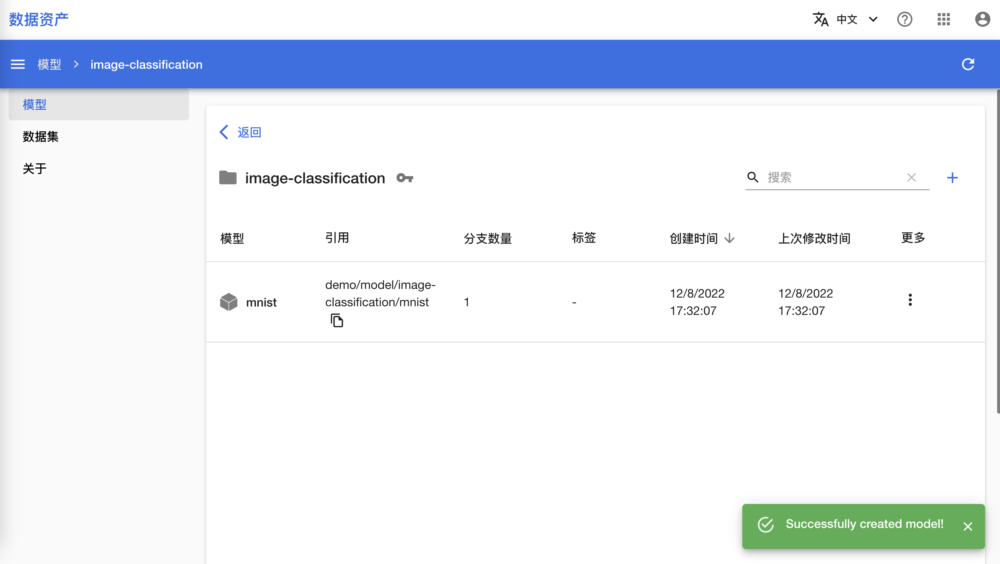

# 操作 Folder 和 Asset

本教程演示如何通过多种方式操作 Folder 和 Asset，包括创建、查看和删除 Asset Hub 中的 Folder 和各类 Asset。

## 准备工作

* [安装](../../tool/tensorstack-sdk/user-guide.md#安装) TensorStack SDK 并阅读[用户指南](../../tool/tensorstack-sdk/user-guide.md)。

## 通过命令行工具

切换到您的工作路径下：

```shell
$ cd /your/workpath
```

假设当前用户（这里以 `user` 表示）没有可以访问的 Folder，使用 `ah create` 命令创建一个 Model Folder 和一个 Dataset Folder：

```shell
$ ah create model/llm
AH INFO: Folder /user/t9k-assethub/model/llm created

$ ah create dataset/text
AH INFO: Folder /user/t9k-assethub/dataset/text created
```

!!! tip "提示"
    限于篇幅，本教程以及后续教程将仅展示各条命令的基本用法，请使用 `--help` 选项（例如 `ah create --help`）查看相应命令接受的参数格式、所有选项以及具体用例。

然后使用 `ah create` 命令在 Model Folder 中创建一个 Model，以及在 Dataset Folder 中创建一个 Dataset：

```shell
$ ah create model/llm/gpt2
AH INFO: Model gpt2 created for Folder /user/t9k-assethub/model/llm

$ ah create dataset/text/openwebtext
AH INFO: Dataset openwebtext created for Folder /user/t9k-assethub/dataset/text
```

创建完成之后，使用 `ah ls` 命令查看当前用户的 Model Folder 和 Dataset Folder：

```shell
$ ah ls model
NAME    PATH                          LABELS    PERMISSION
llm     /user/t9k-assethub/model/llm             own

$ ah ls dataset
NAME    PATH                              LABELS    PERMISSION
text    /user/t9k-assethub/dataset/text              own
```

使用 `ah ls` 命令查看 Model Folder 下的所有 Model 以及 Dataset Folder 下的所有 Dataset：

```shell
$ ah ls model/llm
NAME    PATH                              LABELS    PERMISSION
gpt2    /user/t9k-assethub/model/llm/gpt2            own

$ ah ls dataset/text
NAME         PATH                                        LABELS    PERMISSION
openwebtext  /user/t9k-assethub/dataset/text/openwebtext            own
```

最后使用 `ah delete` 命令删除所有创建的 Model、Dataset 和 Folder：

```shell
$ ah delete model/llm/gpt2
AH INFO: Model /user/t9k-assethub/model/llm/gpt2 deleted

$ ah delete dataset/text/openwebtext
AH INFO: Dataset /user/t9k-assethub/dataset/text/openwebtext deleted

# 可以直接删除 Folder, 其中的 Model 或 Dataset 都会被一并删除
$ ah delete model/llm
AH INFO: Folder /user/t9k-assethub/model/llm deleted

$ ah delete dataset/text
AH INFO: Folder /user/t9k-assethub/dataset/text deleted
```

!!! note "注意"
    删除 Model、Dataset 和 Folder 时会一并删除其中的所有内容，请慎重操作。

## 通过 Python SDK

切换到您的工作路径下，然后以任意方式执行下面的 Python 代码。

导入 `t9k.ah` 模块，使用 `ah.login()` 函数登录到 Asset Hub 服务器（如果配置文件中的凭据仍有效，则无需提供参数）：

```python
from t9k import ah

ah.login(host='<asset-hub-server-url>',
         api_key='<your-api-key>')
```

```
AH INFO: Logged in to Asset Hub server and AIStore server as user <your-user-name>
```

假设当前用户（这里以 `user` 表示）没有可以访问的 Folder，使用 `ah.create()` 函数创建一个 Model Folder 和一个 Dataset Folder，各返回一个 `Folder` 实例：

```python
model_folder = ah.create('model/llm')
dataset_folder = ah.create('dataset/text')
```

```
AH INFO: Folder /user/t9k-assethub/model/llm created
AH INFO: Folder /user/t9k-assethub/dataset/text created
```

!!! tip "提示"
    限于篇幅，本教程以及后续教程将仅展示各个函数或方法的基本用法，相应函数或方法接受的参数详情以及具体用例请参考 TensorStack SDK 的 [API 文档](../../tool/tensorstack-sdk/api/index.md)。

继续使用 `ah.create()` 函数在 Model Folder 中创建一个 Model，以及在 Dataset Folder 中创建一个 Dataset：

```python
model = ah.create('model/llm/gpt2')
dataset = ah.create('dataset/text/openwebtext')
```

```
AH INFO: Model gpt2 created for Folder /user/t9k-assethub/model/llm
AH INFO: Dataset openwebtext created for Folder /user/t9k-assethub/dataset/text
```

!!! tip "提示"
    亦可使用 `Folder` 实例的 `create_asset()` 方法完成上述操作。

创建完成之后，使用 `ah.list()` 函数返回当前用户的 Folder：

```python
from pprint import pprint

pprint(ah.list('model'))
pprint(ah.list('dataset'))
```

```
[{'description': '',
  'editor': 'user',
  'extra': '{"createdTimestamp": "2023-08-17T08:05:24.044319Z"}',
  'id': '967a5135-8b13-4283-9fad-ba53503612b3',
  'labels': [],
  'modifiedTimestamp': '2023-08-17T08:05:24.390002Z',
  'name': 'llm',
  'path': '/user/t9k-assethub/model/llm',
  'permission': 'own',
  'storageType': 0,
  'type': 'Folder'}]
[{'description': '',
  'editor': 'user',
  'extra': '{"createdTimestamp": "2023-08-17T08:05:24.196610Z"}',
  'id': 'd0d9f4b2-6c15-4dbb-b2d1-0619b6774c4a',
  'labels': [],
  'modifiedTimestamp': '2023-08-17T08:05:24.519213Z',
  'name': 'text',
  'path': '/user/t9k-assethub/dataset/text',
  'permission': 'own',
  'storageType': 0,
  'type': 'Folder'}]
```

继续使用 `ah.list()` 函数返回 Model Folder 下的所有 Model 和 Dataset Folder 下的所有 Dataset：

```python
pprint(ah.list('model/llm'))
pprint(ah.list('dataset/text'))
```

```
[{'description': '',
  'editor': 'user',
  'extra': '{"createdTimestamp": "2023-08-17T08:11:09.948554Z"}',
  'id': '2157a139-e20b-4736-9e25-d4495e287af8',
  'labels': [],
  'modifiedTimestamp': '2023-08-17T08:11:10.327166Z',
  'name': 'gpt2',
  'path': '/user/t9k-assethub/model/llm/gpt2',
  'permission': 'own',
  'storageType': 3,
  'type': 'Model'}]
[{'description': '',
  'editor': 'user',
  'extra': '{"createdTimestamp": "2023-08-17T08:11:10.508407Z"}',
  'id': '6826131c-2c88-483e-8a48-0f6d8fa59cfa',
  'labels': [],
  'modifiedTimestamp': '2023-08-17T08:11:10.830665Z',
  'name': 'openwebtext',
  'path': '/user/t9k-assethub/dataset/text/openwebtext',
  'permission': 'own',
  'storageType': 3,
  'type': 'Dataset'}]
```

!!! tip "提示"
    亦可使用 `Folder` 实例的 `list_asset()` 方法完成上述操作。

最后使用 `ah.delete()` 函数删除所有创建的 Model、Dataset 和 Folder：

```python
ah.delete('model/llm/gpt2')
ah.delete('dataset/text/openwebtext')
ah.delete('model/llm')    # 可以直接删除 Folder, 其中的 Model 或 Dataset 都会被一并删除
ah.delete('dataset/text')
```

```
AH INFO: Model /user/t9k-assethub/model/llm/gpt2 deleted
AH INFO: Dataset /user/t9k-assethub/dataset/text/openwebtext deleted
AH INFO: Folder /user/t9k-assethub/model/llm deleted
AH INFO: Folder /user/t9k-assethub/dataset/text deleted
```

!!! tip "提示"
    亦可使用各实例的 `delete()` 方法完成上述操作。

## 通过控制台

数据集文件夹、数据集的控制台操作分别和模型文件夹、模型完全一致。本教程后续仅展示模型文件夹和模型的创建、查看、删除、分享功能，您可以用同样的方式操作数据集文件夹和数据集。

在左侧的导航菜单中点击**模型**，选择查看范围为 **All**，查看当前用户可以访问的所有模型文件夹。然后点击右上角的 **+** 创建新的模型文件夹：

<figure class="screenshot">
  
</figure>

填写名称 `image-classification`，点击标签右侧的 **+**，添加标签 `image`，最后点击**创建**：

<figure class="screenshot">
  
</figure>

接下来分享这个文件夹。点击文件夹右侧的 **更多 > 分享**：

<figure class="screenshot">
  
</figure>

点击**添加分享目标**，选择分享的对象为 **Public**（所有用户可见），分享的权限是 **Editor**，最后点击**分享**：

<figure class="screenshot">
  
</figure>

回到 Asset Hub 控制台，点击模型文件夹 **image-classification** 查看其中的模型：

<figure class="screenshot">
  
</figure>

新创建的模型文件夹中没有模型，点击右上角的 **+** 创建一个模型：

<figure class="screenshot">
  
</figure>

填写名称 `mnist`，然后点击**创建**：

<figure class="screenshot">
  
</figure>

创建成功后，在模型文件夹中可以看到模型信息：

<figure class="screenshot">
  
</figure>

点击**更多 > 删除**，删除创建的模型，然后点击左上角的**返回**，返回模型文件夹的页面：

<figure class="screenshot">
  
</figure>

最后，返回 Asset Hub 控制台，点击**更多 > 删除**，删除模型文件夹：

<figure class="screenshot">
  
</figure>
