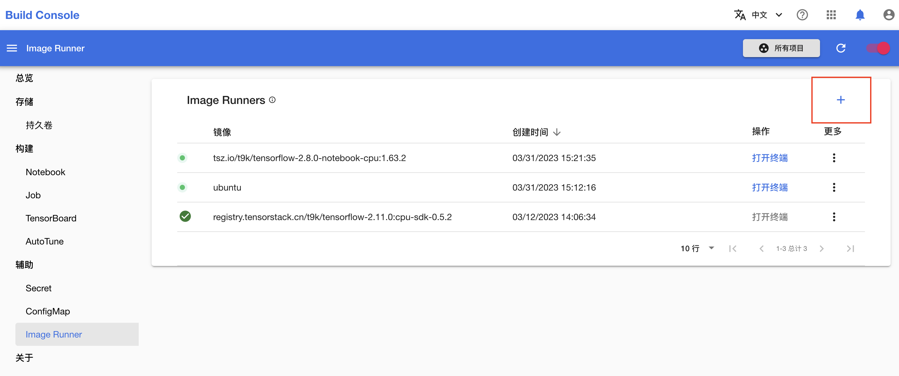
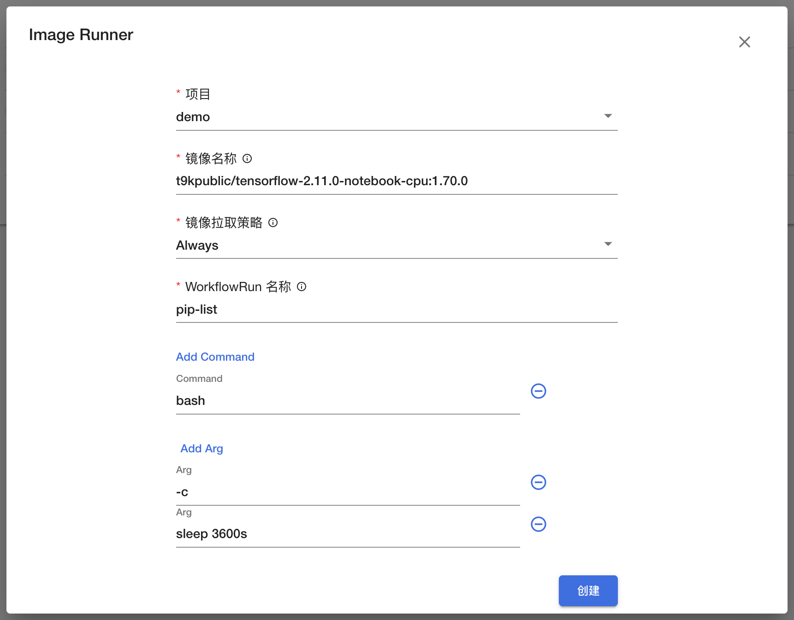
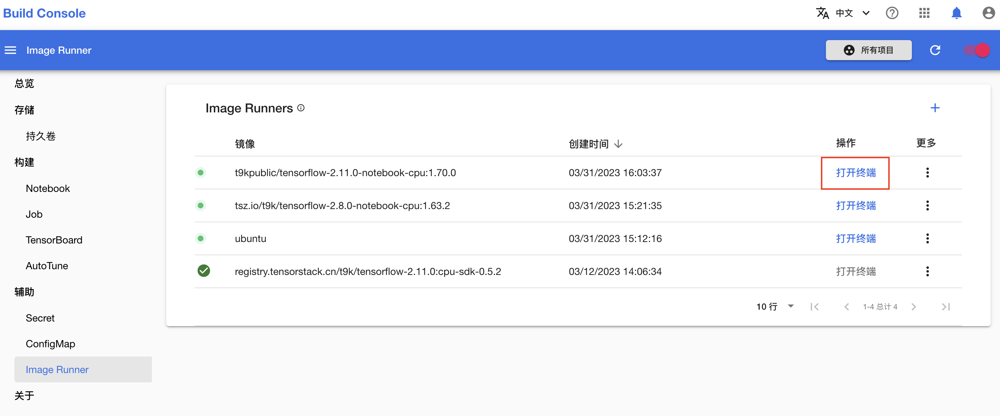
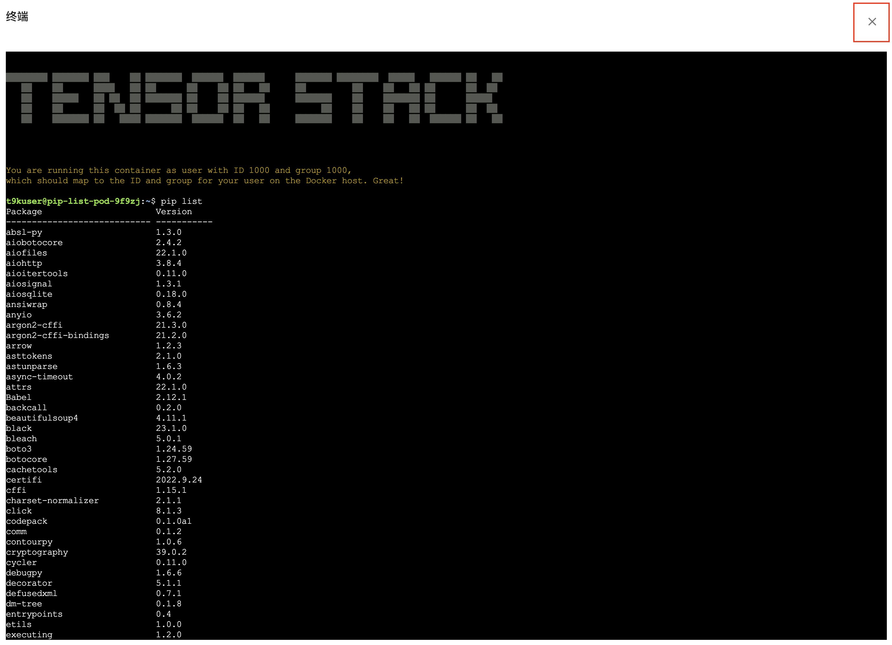

# 调试镜像

本教程演示如何方便地在模型构建控制台通过命令行进入一个镜像，以便对镜像进行探索和测试。

## 准备工作

* 成为一个 [Project](../../module/security/index.md#project) 的[所有者](../manage-project/create-and-delete-project.md)或者[成员](../manage-project/project-add-member.md)。

## 示例

假设我们想知道镜像 `t9kpublic/tensorflow-2.11.0-notebook-cpu:1.70.0` 中安装了哪些 pip 包。

进入模型构建控制台后，点击**辅助 > Image Runner** 进入 Image Runner 管理页面。

<figure class="screenshot">
  
</figure>

点击右上角的 **+** 以创建一个 Image Runner。Image Runner 的原理是基于所要调试的镜像创建一个 [WorkflowRun](../../module/workflow/workflow/workflowrun.md)，执行 `sleep` 命令使镜像保持运行状态，以便我们连接镜像中的 `bash`（或 `sh`）终端。

<figure class="screenshot">
  
</figure>

分别填写项目名称、镜像名称，其他选项保持默认即可，然后点击**创建**。

<figure class="screenshot">
  
</figure>

所创建的 Image Runner 变为运行状态后，点击**打开终端**。

<figure class="screenshot">
  
</figure>

在打开的终端中，输入 `pip list` 显示该镜像中安装的所有 pip 包，或者输入其他任何命令。

最后，点击右上角的 **X** 关闭终端。
