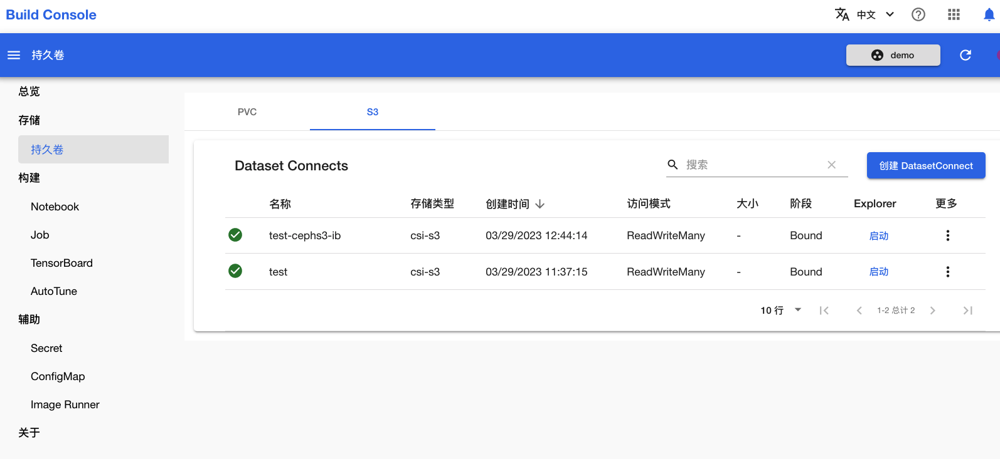

# 通过 PVC 使用 S3

## 概述

TensorStack AI 平台支持用户在多个环节使用 [S3 协议:octicons-link-external-16:](https://en.wikipedia.org/wiki/Amazon_S3)的存储服务。本教程演示如何使用平台提供的 DatasetConnect 功能通过 PVC 的形式使用 S3。

本教程涉及如下基本概念：

* **[S3（Simple Storage Service）:octicons-link-external-16:](https://aws.amazon.com/cn/s3/)**提供可扩展、安全、高可用的对象存储服务，可以存储和检索任意数量和类型的数据，包括文档、图片、视频、音频等。更多详细信息请参阅[附录](#附录)。
* **[PVC（PersistentVolumeClaim）:octicons-link-external-16:](https://kubernetes.io/docs/concepts/storage/persistent-volumes/)**是 Kubernetes 提供的一种声明式的存储卷请求，用于向 Kubernetes 集群申请持久化存储卷。PVC 使应用程序与存储资源进行解耦，提高了存储资源的管理和使用效率。
* **T9k DatasetConnect** 提供了把 S3 服务转换为 PVC 的能力，让用户能够以 Kubernetes 原生的方式使用 S3。

## 详细过程

要访问 S3 服务，需要提供使用其服务的相应配置，包括：

* S3 访问凭证：用于访问 S3 服务的一组密钥，包括访问密钥（access key）和秘密访问密钥（secret key）。S3 访问凭证是必需的，以便在访问 S3 服务时进行身份验证和授权。
* S3 服务的终端地址（endpoint）：HTTP 或 HTTPS 格式的地址，例如：`http://100.1.1.2:8000`。
* S3 bucket：存储用户数据的容器；访问特定的 bucket 需要有合适权限的访问凭证。

### 准备 S3 配置

以下面的格式准备一个名为 `s3cfg` 的文件：

```
[default]
# Setup access keys
access_key = <you-access-key>
secret_key = <your-secret-key>

# Setup endpoint
host_base = http[s]://<host-or-ip>:<port>
use_https = <False | True>
```

其中需要修改的内容包括：

* `access_key`：您的访问密钥（access key）。
* `secret_key`：您的秘密访问密钥（secret key）。
* `host_base`：S3 服务的地址（endpoint）。
* `use_https`：是否使用 HTTPS。

您可以[安装 s3cmd](#s3-基本使用---s3cmd)，在本地运行命令来验证 s3cfg 是否正确配置：

``` shell
s3cmd -c s3cfg ls s3://<my-bucket>
```

### 创建 Secret 来保存 S3 凭证

#### 通过网页控制台

进入模型构建控制台，选择左侧导航菜单的**辅助 > Secret**，点击**创建 Secret**。

选择类型为 **S3-cfg**，填写名称，然后填写 Details 的内容：

* 服务端点：S3 服务的地址（endpoint）
* Access Key ID：您的访问密钥（access key）。
* 密码：您的秘密访问密钥（secret key）。

最后点击**创建 Secret**：

<figure class="screenshot">
  
</figure>

#### 通过命令行工具

您可以使用 kubectl 命令行工具创建 Secret：

``` shell
kubectl -n <project> create secret generic <s3cfg-secret> \
  --from-file=.s3cfg=<s3cfg>
```

其中需要修改的内容包括：

* `<project>`：项目名称。
* `<s3cfg-secret>`：Secret 的名称。
* `<s3cfg>`：本地 `s3cfg` 文件的路径。前面的 `--from-file=.s3cfg=` 不需要修改。

#### 验证

运行以下命令，查看 Secret 中保存的 `.s3cfg` 内容：

``` shell
kubectl -n <project> get secret <s3cfg-secret> \
    -o jsonpath={.data."\.s3cfg"} | base64 -d
```

其中需要修改的内容包括：

* `<project>`：项目名称。
* `<s3cfg-secret>`：Secret 的名称。

对比输出内容与您本地的 `s3cfg`，确认内容一致，重点是 `access_key`、`host_base` 和 `secret_key` 字段。

 

### 创建 PVC

#### 通过网页控制台

进入模型构建控制台，选择左侧导航菜单的**存储 > 持久卷**，点击上方的 S3，然后点击右上角的**创建 DatasetConnect**：

<figure class="screenshot">
  
</figure>

输入持久卷名称、S3 URI（`s3://<your-bucket>`），然后选择 S3 Secret 名称，最后点击右上角的**创建 DatasetConnect** 完成创建：

<figure class="screenshot">
  
</figure>

在 S3 标签页查看新创建的 DatasetConnect：

<figure class="screenshot">
  
</figure>

#### 通过命令行工具

使用以下命令创建 DatasetConnect 类型的 PVC：

``` shell
kubectl -n <project> create -f - <<EOF
apiVersion: tensorstack.dev/v1beta1
kind: DatasetConnect
metadata:
  name: dataset
spec:
  readOnly: false
  s3:
    uri: 's3://42a3de90-d9e7-4769-8fc4-48a65fb561d5'
  secretRef:
    name: s3cfg-secret
EOF
```

其中需要修改的内容包括：

* `<project>`：项目名称。
* `.spec.s3.uri`：S3 bucket 的路径，您也可以具体指定 bucket 中的一个文件夹。
* `.spec.secretRef.name`：保存 S3 凭证的 Secret 名称。
* `readOnly`：如果为 true，那么用户只能读取这个 DatasetConnect 的内容，而不能修改它。

查看 PVC 状态，确认 STATUS 为 Bound：

``` shell
$ kubectl -n <project> get pvc
NAME                STATUS   VOLUME                                     CAPACITY   ACCESS MODES   STORAGECLASS     AGE
dataset             Bound    pvc-cc7f789a-6fcb-44a0-8f42-0e6c86e51a1a   1          RWX            csi-s3           4m5s
```

## 附录

### S3 基本概念

S3（Simple Storage Service）提供了可扩展、安全、高可用的对象存储服务，可以存储和检索任意数量和类型的数据，包括文档、图片、视频、音频等。

S3 使用：

* Bucket：Bucket 是 S3 存储中的基本容器，类似于文件夹，用于存储和组织对象。每个 Bucket 必须具有唯一的名称，并且名称必须符合 DNS 命名规则。
* Object：Object 是 S3 存储中的基本数据单元，可以是任意类型的数据，例如文档、图片、视频、音频等。每个 Object 由一个唯一的键（Key）和一个值（Value）组成，键是 Object 在 Bucket 中的唯一标识符，值是 Object 的实际数据。

S3 管理：

* Region：Region 是 S3 存储的物理位置，用于指定 Bucket 存储的地理位置。每个 Region 都由多个可用区域（Availability Zone）组成，以提供高可用性和容错性。
* ACL：ACL（Access Control List）是 S3 存储的访问控制列表，用于控制 Bucket 和 Object 的访问权限。ACL 可以指定特定用户或组的访问权限，也可以指定公共访问权限。
* Versioning：Versioning 是 S3 存储的版本控制功能，用于保留 Object 的所有版本。启用版本控制后，每次更新 Object 时都会创建一个新版本，并可以通过指定版本号来访问特定版本的 Object。
* Lifecycle：Lifecycle 是 S3 存储的生命周期管理功能，用于自动化管理 Bucket 和 Object 的生命周期。Lifecycle 可以指定 Object 的存储期限、转换存储类别、自动删除 Object 等操作，以优化存储成本和管理效率。

### S3 基本使用 - s3cmd

有多种工具（s3browser、WinSCP、s3cmd、s5cmd、rclone 等）可以访问 S3 存储服务，以下使用 s3cmd 演示 S3 的基本操作：

安装 s3cmd 工具：在 Linux 系统中使用命令行安装 s3cmd 工具，例如在 Ubuntu 系统中可以使用以下命令进行安装：

``` shell
sudo apt-get install s3cmd
```

配置 s3cmd 工具：在命令行中执行 `s3cmd --configure` 命令，按照提示输入 S3 访问密钥和秘密访问密钥，以及 S3 服务的访问地址和区域等参数，完成 s3cmd 工具的配置。

创建 S3 存储桶：使用 s3cmd mb 命令创建 S3 存储桶，例如：

``` shell
s3cmd mb s3://my-bucket-name
```

上传对象：使用 s3cmd put 命令上传对象到 S3 存储桶中，例如：

``` shell
s3cmd put /path/to/local/file s3://my-bucket-name/path/to/remote/file
```

下载对象：使用 s3cmd get 命令从 S3 存储桶中下载对象到本地，例如：

``` shell
s3cmd get s3://my-bucket-name/path/to/remote/file /path/to/local/file
```

删除对象：使用 s3cmd del 命令从 S3 存储桶中删除对象，例如：

``` shell
s3cmd del s3://my-bucket-name/path/to/remote/file
```

设置对象 ACL：使用 s3cmd setacl 命令设置对象的 ACL，例如：

``` shell
s3cmd setacl --acl-public s3://my-bucket-name/path/to/remote/file
```

### 对象存储（object storage）

[对象存储:octicons-link-external-16:](https://en.wikipedia.org/wiki/Object_storage)是一种将数据存储为对象的数据存储架构，这与文件系统将数据作为文件层次结构进行管理不同。 每个对象通常包括数据本身（object）、元数据（metadata）和全局唯一标识符（object key）。

对象存储是存储海量非结构化数据（例如图像、视频和文档）的不错选择，例如大规模机器学习中使用的海量训练数据、特征、模型等。

与其他存储架构相比，对象存储具有许多优势，包括：

* 可扩展性：对象存储可以轻松扩展以满足不断增长的应用程序的需求。
* 耐用性：对象存储被设计成高度耐用的，数据以冗余方式存储在多个位置。
* 可用性：对象存储旨在提供高可用性，可以从世界任何地方访问数据。
* 安全性：对象存储提供了许多安全功能，包括加密和访问控制。

对象存储是一种强大而灵活的数据存储架构，是存储大量非结构化数据、需要从多个位置访问的数据以及需要高可用性和安全性的数据的不错选择。
