# AI 资产管理

“Asset Hub” 是“TensorStack AI 平台”的 “AI 资产管理系统” 功能模块，提供了 AI 资产（数据集、模型）管理、快速进行模型训练、继续训练和模型评估等功能。“Asset Hub” 构建在 “TensorStack AI 平台”的 Jobs、Workflow 等低层基础系统之上，并可和“TensorStack AI 平台”的其他功能模块进行协同工作。

<figure>
  
</figure>

图 1: Asset Hub 架构。 Asset Hub 提供了方便易用的方式进行数据集管理、模型训练、继续训练、模型评估等工作。这些功能建立在 T9k AI 平台的基础层的 Jobs、Workflow 等核心功能之上，并采用开放系统和协议，例如 Git 代码管理系统和 S3 对象数据存储接口等。

## 概念

Asset Hub 系统中的基本概念：

* 文件夹（Folder）：文件夹功能用来分类管理管理资产（Asset）， 是 Asset Hub 最小的权限管理单位，用户可以通过分享自己的文件夹进行协同工作。一个文件夹只能包含一种类型的资产，根据其包含的内容可分为两类：1）包含模型的文件夹（简称模型文件夹）；2）包含数据集的文件夹（简称数据集文件夹）。一个文件夹中可以包含任意数量的资产。
* 模型：模型用来存放模型文件、评估结果和使用说明。一个模型中可以有一个或多个分支（branch），每个分支由 commits 记录其历史，并支持分支合并（merge）。分支通常用来存储不同条件下训练出来的模型文件及其评估结果。用户可以使用 commit id、branch 名字等方式指定一个特定版本的模型。
* 数据集：数据集用来存放进行模型训练的样本库（可以是训练集、验证集和测试集）。数据集类资产中只有一个 main 分支，由 commits 记录其历史。用户可以使用 commit id 等方式指定一个特定版本的数据集。
* Git 仓库：AI 项目的代码需要存放在 Git 仓库中，并可被 Asset Hub 系统访问。 Asset Hub 在运行模型训练、继续训练、评估时会下载 Git 仓库中的代码。Git 仓库可使用 GitHub，或者私有部署的 GitLab 等。
* Asset：模型和数据集都被称为 Asset，或者 AI Asset。
* Asset Path：用来指示特定 asset ，路径性质的字符串，其格式为 `<owner>/<asset-type>/<folder>/<name>`，其中 `<asset-type>` 是 model（模型）或 dataset（数据集）。例如用户 `demo` 在文件夹 `image-classification` 中创建了一个名为 `mnist` 的模型，那么这个模型的 Asset Path 为 `demo/model/image-classification/mnist`。
* Asset Reference：Asset Reference 是指定一个特定版本 Asset 的方式，其格式为：`<asset-path>:<ref>`，其中 `<ref>` 可以是 Tag、Branch 和 Commit。

完整的 Asset Reference 是下面任意一种形式：
``` bash
<owner>/<asset-type>/<folder>/<name>:<tag>
<owner>/<asset-type>/<folder>/<name>:<branch-name>
<owner>/<asset-type>/<folder>/<name>:<commit>
```

## 功能

Asset Hub 提供以下功能：

* 资产管理：支持增删查改（CRUD）。用户可通过网页、命令行工具、SDK 进行模型、数据集上传、下载、删除、查找、修改等操作。并提供类 Git 的版本管理功能，方便用户查看模型和数据集以 commit 形式记录的修改历史。
* 训练：用户指定Git 仓库、数据集和后就可以快速启动预定义的训练过程。训练完成后的模型文件会被自动保存在 Asset Hub 中，方便进行发布、模型评估、继续训练等工作。
* 继续训练：用户指定模型的一个特定版本、Git 仓库、数据集后即可启动模型继续训练过程。训练完成后的模型文件会被保存在Asset Hub 中模型新的分支中。
* 评估：用户指定模型版本、Git 仓库、数据集，即可进行模型评估过程。结果会被存储在 Asset Hub 中，并且可以通过网页查看。
* 分享：分享一个模型文件夹或者数据集文件夹，支持按照用户、组进行权限控制（只读、可运行、可编辑）。
## 使用流程

用户通过控制台、Python SDK 和命令行工具来使用 Asset Hub 的所有功能。

Asset Hub 的典型使用流程如下：

1. 准备数据集，并上载到 Asset Hub。
2. 准备模型训练、继续训练、评估所需要的 Python 代码，和任务定义的 YAML，并存放到 Git 仓库里。
3. 在 Asset hub 中 创建模型，配置 Git 仓库、数据集等参数。
4. 运行模型训练，得到模型的一个分支。
5. 运行模型评估，得到第一个版本模型的指标。

除此之外，用户还可以：

* 继续运行模型训练、继续训练，得到其他版本的模型，对这些模型进行评估，直到获得满意的指标。
* 对模型、数据集进行版本管理操作，例如将选中的模型分支合并到 main 分支。
