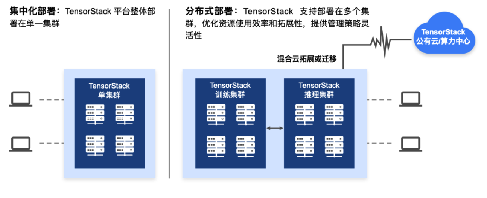

# 应用场景

“TensorStack AI 计算平台”满足现代化企业、科研、教育等组织对 AI 计算的高性能、灵活高扩展和强安全需求，支持在本地、云端和混合云环境中灵活部署，优化资源使用效率和拓展性，提供管理策略灵活性。

“TensorStack AI 计算平台”提供多集群部署能力，对 AI 计算进行统一调度管理，实现 AI 计算能力的共享。同时支持分级部署需求，通过将不同服务运行能力进行拆分，提供多节点多级部署，实现 AI 能力在各个机构节点之间的共享及协作。

<figure class="architecture">
    
    <figcaption align = "center"><b>Fig. 1 - “TensorStack AI 计算平台”的部署方式</b></figcaption>
</figure>

通过建设先进、专业的 AI 计算平台，先进的组织可以实现：

1. 全面先进的 AI 能力，满足研究、开发、应用等场景，支持更多的先进 AI 技术不断投入使用和连续迭代，保障用户获得持续领先的价值；
2. 优化 AI 工作流程，增强团队合作，加速 AI 协同进化；
3. 实现 AI 资源的统一管理和可见性，全局掌控，提高运营、管理效率。
