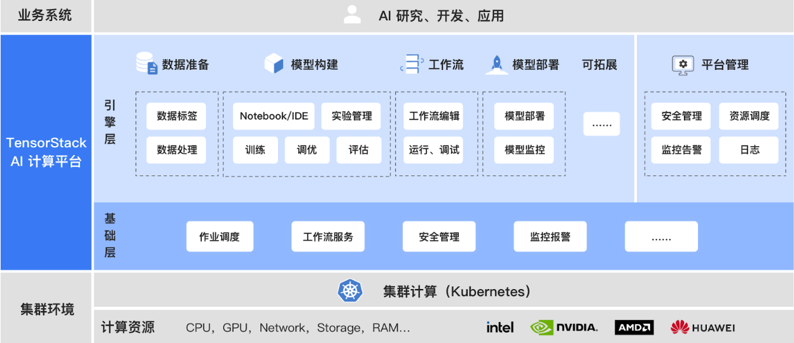

# 产品架构

“TensorStack AI 计算平台”采用云原生架构，由 AI 引擎层（AI infrastructure Engine, AIE）和 AI 基础层（AI infrastructure Base, AIB）组成，为上层 AI 应用和底层 AI 算力建立有机连接，提供先进、可扩展的 AI 基础设施能力。

通过先进的架构和系统服务，“TensorStack AI 计算平台”隐藏了复杂的分布式、异构计算环境下的技术细节，提高了抽象层次，为 AI 领域的各种计算提供了针对性的支持，极大地提升了 AI 技术研究、开发、应用的工作效率。

<figure class="architecture">
    
<figcaption align = "center"><b>Fig. 1 - “TensorStack AI 计算平台”架构</b></figcaption>
</figure>

## 基础层

AI 基础层提供集群计算抽象和多种系统服务，保障 AI 计算任务的高效、可靠、安全运行 。

* **集群调度器（Scheduler）**高效匹配计算任务和计算资源，包含多种高级调度策略和机制，例如 Queue、优先级、资源抢占、资源配额、应用特性感知等。
* **并行计算任务支持（Jobs）**提供 API 使得各种类型的大规模 AI 计算可以方便的被开发、定义、运行、调试和管理。API 采用云原生方式，包含对 Big Data Processing、模型分布并行式训练、MPI 并行计算作业、通用并行计算作业等的支持。
* **工作流（Workflow）**支持用户定制多步骤复杂计算图（DAG）。
* **安全访问控制（Security）**保护平台的系统服务和用户计算负载的安全，提供对资源访问的身份认证、授权和审计。
* **监控和告警（Monitoring/Alerting）**提供对计算任务的日志和运行指标的全面收集和存储；支持定制告警规则、交互式查询、可视化展示等功能，达到对平台计算任务的全面观测和管理。

## 引擎层

AI 引擎层包含多种工具和服务，对 AI 研究、开发、部署提供全流程支持。例如，模型构建模块提供了 Notebook、AutoTune、TrainingJob 等工具，可完成交互式开发、模型调参、运行分布式训练作业等功能。

## 扩展能力
平台提供了强大的扩展能力，以适应不断变化的计算环境和计算任务。例如，针对算力资源，平台提供对 GPU 等设备的扩展支持能力，方便用户使用多家厂商的 GPU 产品；针对不断创新的 AI 计算框架，平台提供定义新的计算任务 API 和集成的能力。
