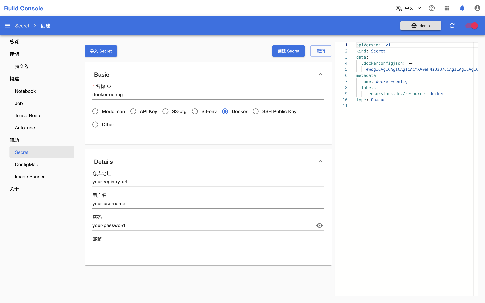
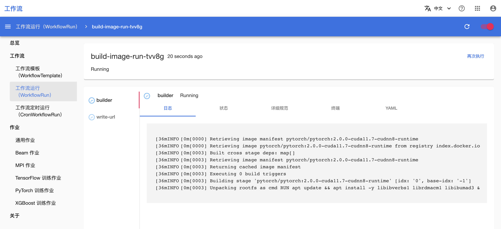
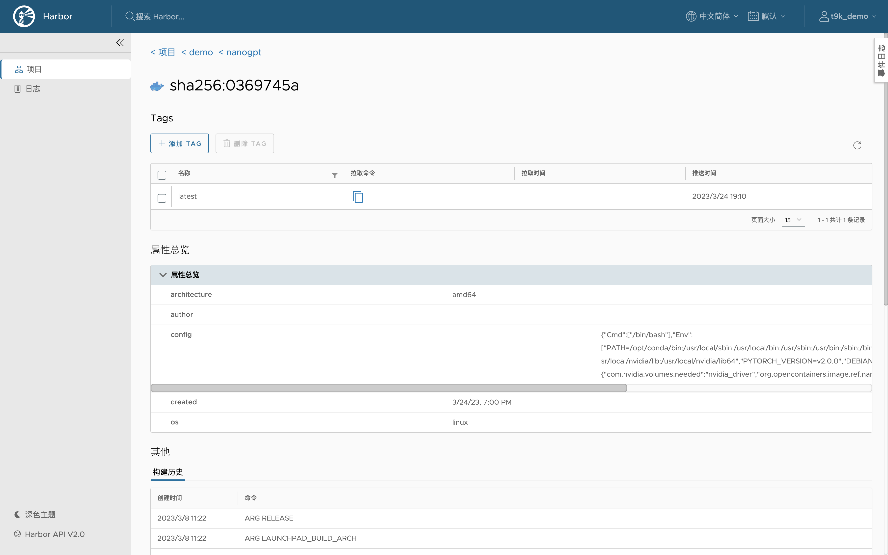

# 在平台上构建镜像

[:octicons-mark-github-16: 查看本教程的示例代码](https://github.com/t9k/tutorial-examples/tree/master/build-image/build-image-on-platform){target=_blank, .md-button }

您可以使用 [Kaniko:octicons-link-external-16:](https://github.com/GoogleContainerTools/kaniko){target=_blank} 在平台上构建 Docker 镜像。本教程演示如何建立并运行一个工作流，以在平台上构建自定义 Docker 镜像并推送到指定的 registry。

## 运行示例

请前往[本教程的示例:octicons-link-external-16:](https://github.com/t9k/tutorial-examples/tree/master/build-image/build-image-on-platform){target=_blank}，参照其 README 文档运行。

其中，创建包含身份信息的 Secret 这一步骤也可以在模型构建控制台中通过创建 `Docker` 类型的 Secret 来完成，如下图所示。详情请参阅[创建 Secret](../../guide/manage-auxiliary-resources/manage-secret.md#创建-secret)。

## 检查构建进度和结果

前往工作流控制台查看镜像的构建日志。拉取基础镜像、构建镜像和推送镜像都需要花费一定的时间，请耐心等待。

!!! note "注意"
    拉取和推送较大的镜像可能会花费较长的时间，取决于具体的网络情况，在这一过程中可能出现网络断线导致工作流失败。

一段时间后，构建完成的镜像被推送到相应的 registry 中。

