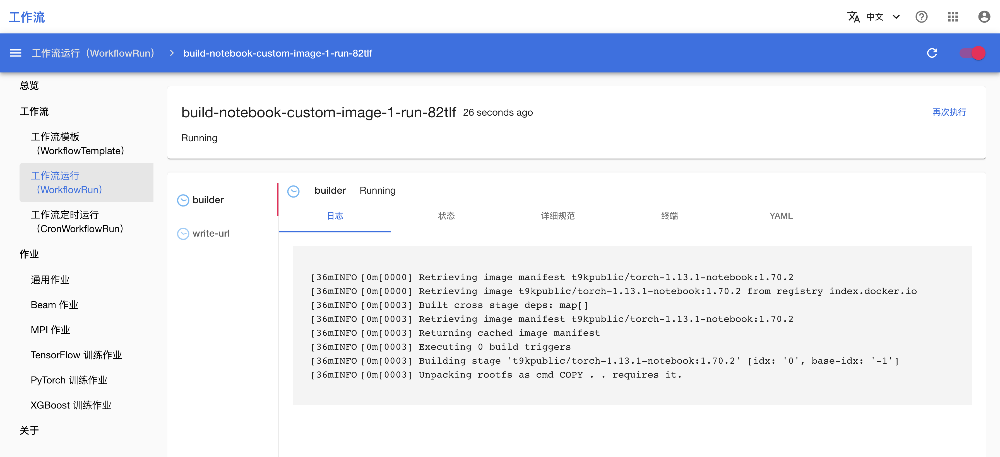
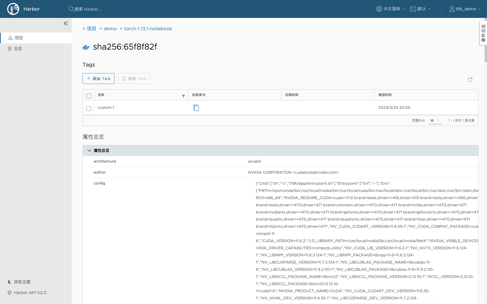
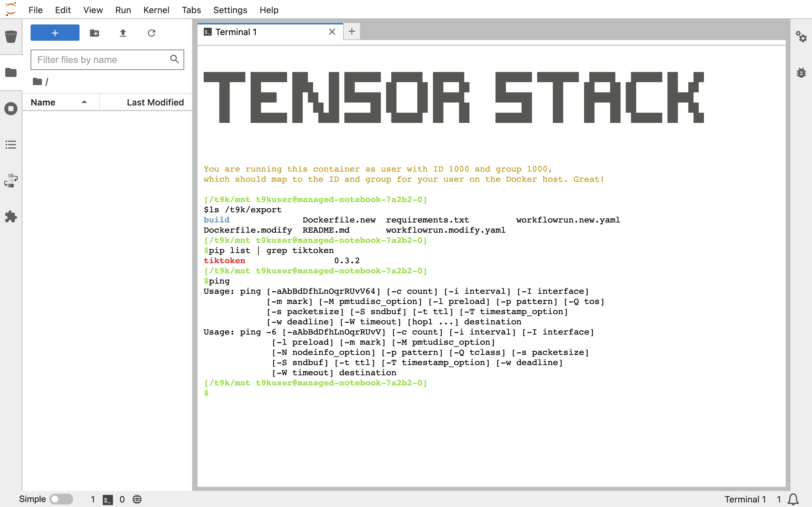

# 构建 Notebook 自定义镜像

[:octicons-mark-github-16: 查看本教程的示例代码](https://github.com/t9k/tutorial-examples/tree/master/build-image/build-notebook-custom-image){target=_blank, .md-button}

除了使用平台提供的 [Notebook 标准镜像](./notebook-standard-image-list.md)，您也可以根据自己的需求构建自定义镜像，以满足具体的模型构建环境要求，并便于重复使用。

本教程演示如何构建 Notebook 自定义镜像，并且提供两种方法：在标准镜像的基础上进行修改，或者从零开始构建。

本教程采用[在平台上构建镜像](./build-image-on-platform.md)的方式，您也可以使用相同的构建上下文在其他机器上进行构建。

!!! tip "提示"
    如果您没有重复使用的需求，推荐直接使用标准镜像创建 Notebook，进入 Notebook 后使用终端拉取文件，或为其安装 Python 包和 Debian 软件包（需要 `sudo` 命令）。

## 运行示例

请前往[本教程的示例:octicons-link-external-16:](https://github.com/t9k/tutorial-examples/tree/master/build-image/build-notebook-custom-image){target=_blank}，参照其 README 文档运行。

## 检查构建进度和结果

前往工作流控制台查看镜像的构建日志。拉取基础镜像、构建镜像和推送镜像都需要花费一定的时间，请耐心等待。

!!! note "注意"
    拉取和推送较大的镜像可能会花费较长的时间，取决于具体的网络情况，在这一过程中可能出现网络断线导致工作流失败。

一段时间后，构建完成的镜像被推送到相应的 registry 中。

最后使用示例中构建的自定义镜像[创建 Notebook](../../guide/develop-and-test-model/create-notebook.md)：**镜像类型**选择 `Custom`，**镜像**填写镜像名称，其他参数照常填写。进入 Notebook 后，可以看到自定义增加的文件、Python 包和 Debian 软件包。

