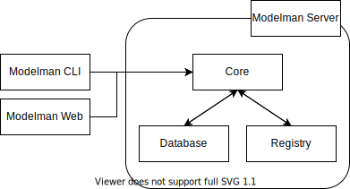

# 模型管理命令行工具

模型管理命令行工具（Model Management CLI）是[模型管理模块](../../module/model/index.md)的一部分，用于和模型管理服务器进行交互，实现用户登录、登出，模型的上传、下载等功能。

<figure>
  
</figure>

模型管理服务器以 [Modelpack](../../module/model/modelpack.md) 的形式存储机器学习模型。用户使用模型管理命令行工具和[模型管理控制台](../../guide/manage-model/use-model-console.md)这两个工具进行和模型管理服务器的交互。
